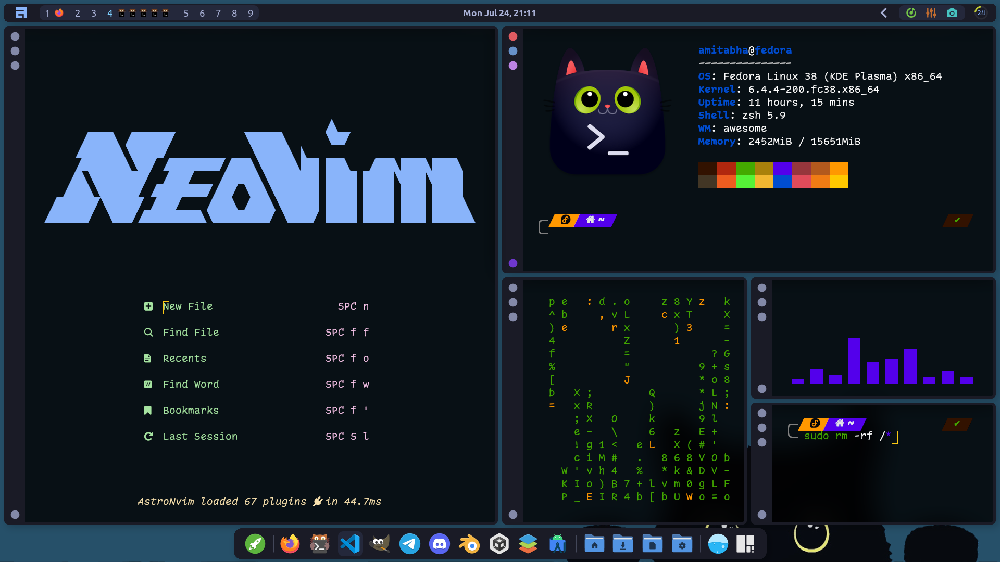
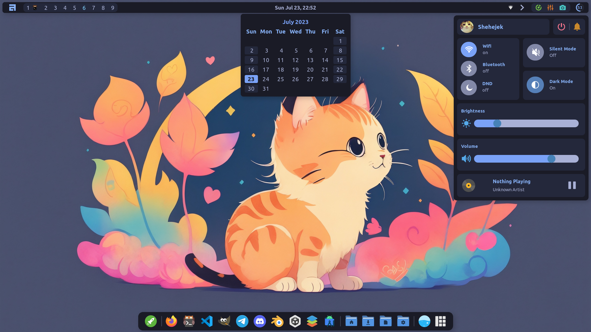
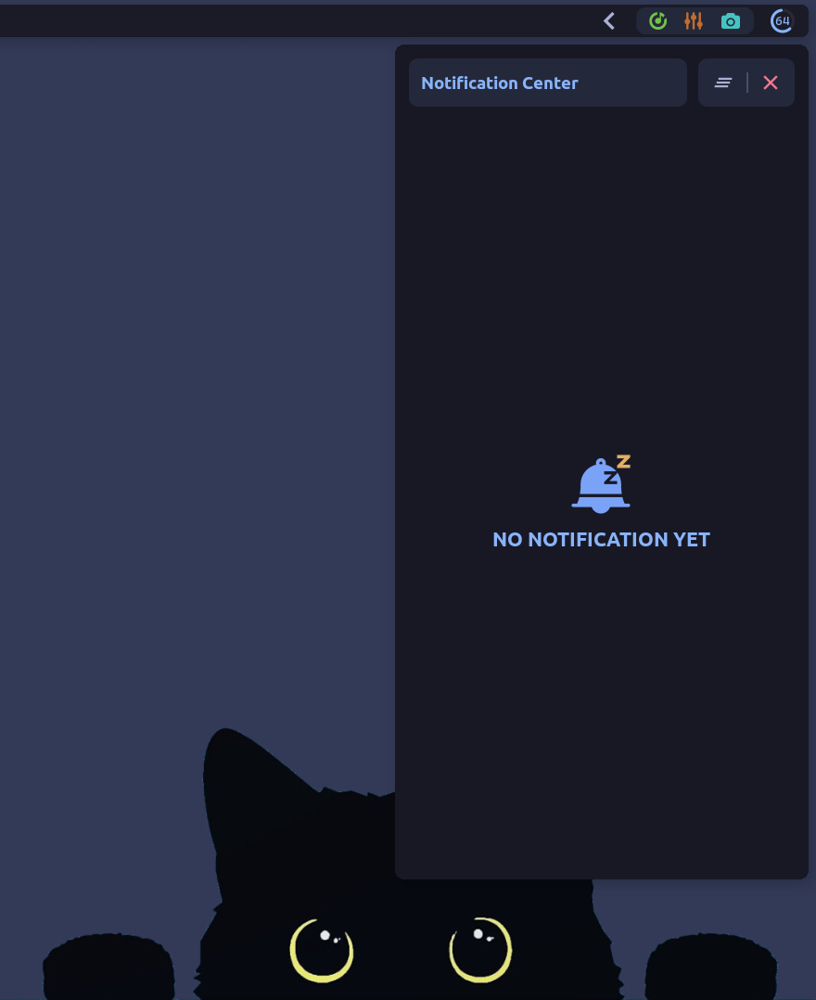
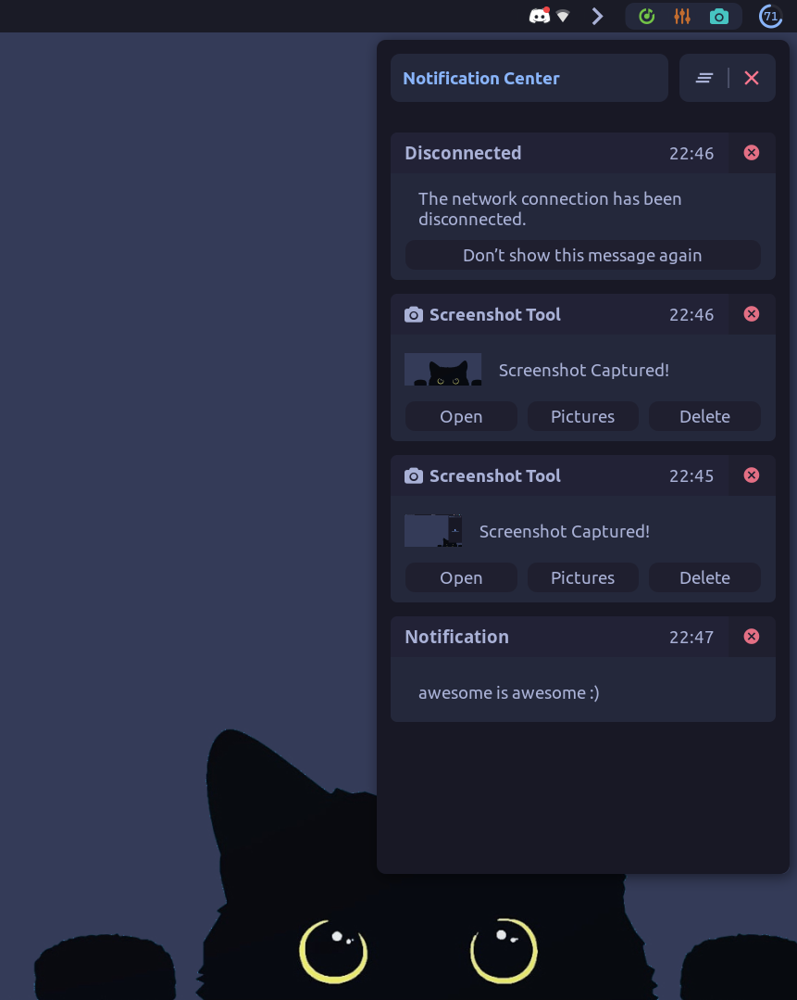
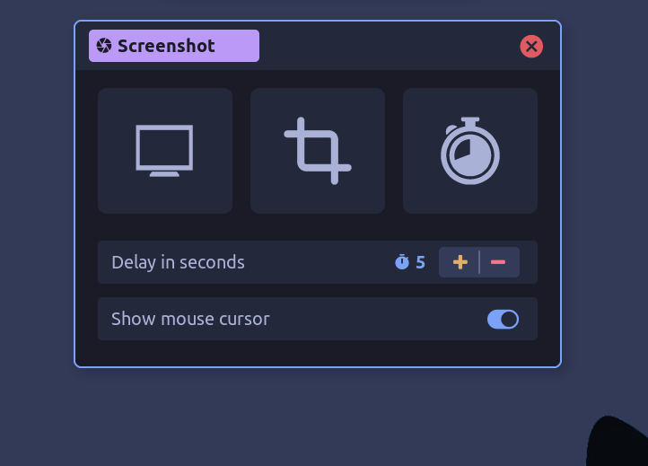
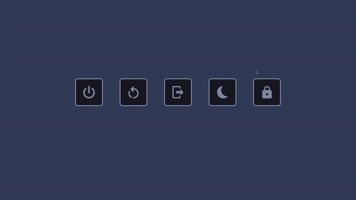
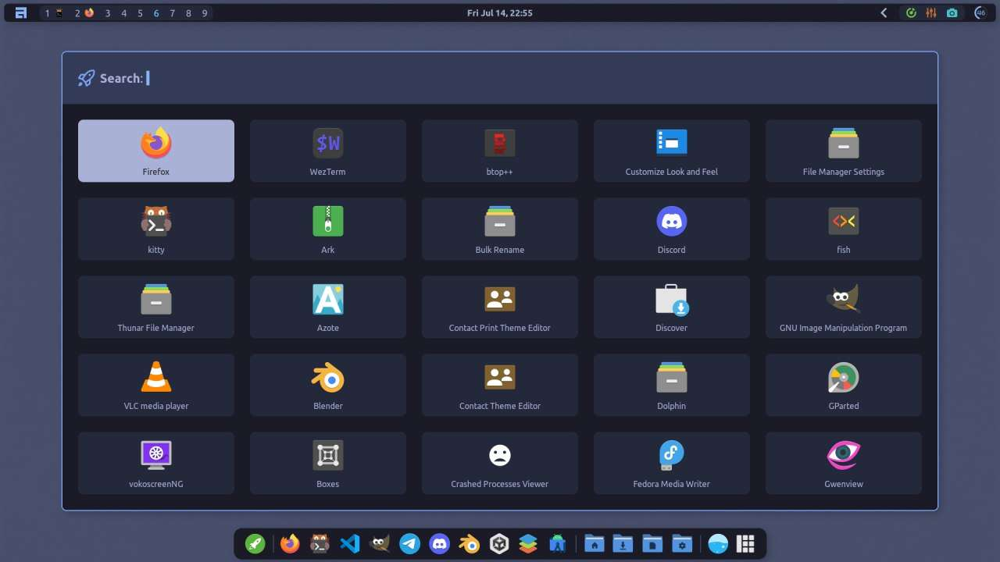
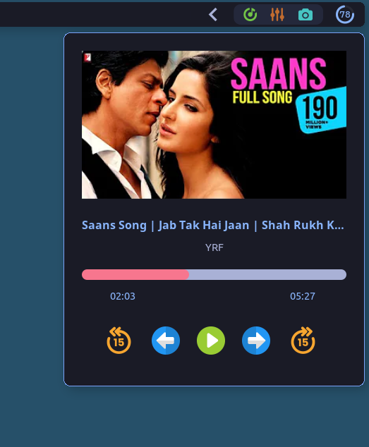

<p align="center"></p>
<h4 align="center">Featuring AwesomeWM</h4><br/><br/>

<p align="center"></p><br>

Welcome to my stash of dotfiles of my awesomewm setup. Note that things are likely to be changed in future as I am still working on this setup.
Feel free to give a :star: to this repo if you liked the setup. It is much appreciated :3

---

## Dependencies

- **AwesomeWM**: Use the git version. Stable version will not work.
- **Picom**: Use any picom fork of your liking. You can even skip this if you are not a fan of fancy effects and blur. It doesn't matter.
- **nm-applet**: Used for wifi.
- **Light**: Required for the brightness control slider
- **Alsa Utils**: Required for the volume control slider.
- **acpi**: Required for the battery widget. You can skip that if you don't have a battery.
- **feh**: Yes, I still use feh for wallpaper. Don't bully me :/
- **Notrogen**: Another wallpaper setter. This is optional though.
- **Playerctl**: Required for the music player widget located in the control center.
- **Redshift**: Used in the bluelight filter widget.
- **Scrot**: Used in screenshot tool
- **Font**: Ubuntu Nerd font is used most of the ui, CaskaydiaCove nerd font and JetbrainsMono nerd font is also used in some place.
- **Icon Theme**: Papirus(required)
- **GTK Theme**: Lavanda Dark Compact Tokyonight (Thanks to <a href="https://github.com/mehedirm6244">Mebesus</a>)

These are all I remember right now. If there is any other dependencies that I missed, feel free to open an github issue to inform me.

## Defaults

- **File manager**: Thunar
- **Terminal**: Kitty
- **Browser**: Firefox

---

## Installation

Installing the config may break somethings in your pc as I can only try them in my computer. But in case you want to use them anyway, follow the bellow steps:-

<details>
<summary><b style="font-size:20px">Install Awesome-git</b></summary>

<br>
<b>Arch</b>

```bash
yay -S awesome-git
```

<br>

<b>Fedora</b><br>
You can build from source, or you can use COPR if you are lazy like me. For installing through COPR, follow below steps:-

```bash
sudo dnf copr enable coolj/awesome-luajit-nightly
sudo dnf install awesome
```

<br>

<b>Ubuntu and other Debian based</b><br>
Again, you can build from source, or you can use pacstall. To install using pacstall, followbelow steps:-

```bash
sudo bash -c "$(wget -q https://pacstall.dev/q/install -O -)"    #for setting up pacstall(Skip if you already done it)
pacstall -I awesome-git
```

</details>
<br>
<details>
<summary><b style="font-size:20px">Install Dependencies</b></summary>

Use the package manager to install the following dependencies:-

```bash
nm-applet light alsa-utils feh nitrogen acpi playerctl redshift scrot
```

The name of some packages may vary based on your distro.
<i> <b>Note</b>: For Ubuntu and ubuntu/debian based distros additional dependency `libplayerctl-dev` </i>

</details>
<br>
<details>
<summary><b style="font-size:20px">Move the files to their location</b></summary>

Clone this repository:-

```bash
git clone git@github.com:Amitabha37377/Awful-DOTS.git
cd Awful-DOTS
```

Make `~/.themes`, `~/.icons`, `~/.local/share/fonts` directories if not exists already.

```bash
mkdir ~/.themes
mkdir ~/.icons
mkdir ~/.local/share/fonts
```

Move the files in their required directory:-

```bash
mv ~/.config/awesome ~/.config/awesome.bak
cp -r awesome ~/.config/
cp -r Misc/fonts/* ~/.local/share/fonts/
cp -r Misc/gtk_themes/* ~/.themes/
cp -r Misc/icon_packs/* ~/.icons/
```

</details>
<br>
After following all the steps restart awesome wm. Hopefully everything will work.
Feel free to open a github issue if you face any problem. I am nowhere near an awesomewm/lua expert but I will try my best to help.
---

## Gallery

- #### Control Center & Calendar

  <i>(Yes I copied from apple)</i>
  <p align="center"></p>

- #### Notification Center

<p align="center">


</p>

- #### Screenshot Tool

<p align="center"></p>

- #### Powermenu

<p align="center"></p>

- #### App Launcher(Bling)

<p align="center"></p>

- #### Media Player (Supports Youtube, Idk what else it supports)
<p align="center"></p>

---

## Featured and Widgets

- Dock with always visible and auto hide mode interchangable by pressing mod+z
- Control Center
- Notification Center
- Fancy taglist for tag+tasklist preview
- Bling app launcher
- Non bling app launcher
- Screenshot tool(WIP)
- Lots of bugs
- Lots of incomplete stuffs

## To Do

- Screen recording widget
- A good looking Dashboard
- System monitor widget
- To do widget
- <s>Music player widget outside the control center</s>
- Improve animations (maybe)
- Remove the last feature

---

- #### How to make the media player functional?
  First make sure that `plasma-browser-integration` package is installed in your system. Install `plasma integration` browser extension in firefox.
  Go to the manage extension settings of the `plasma integration` extension and uncheck `Enhanced Media Control`. Hopefully it will work.

---

## Credits

- <a href="https://github.com/Stardust-kyun"><b>Stardust kyun</b></a> (His absolutely amazing beginner friendly dotfiles. Stole some part of code from his notification center, app launcher, notification settings)
- <a href="https://github.com/rxyhn"><b>rxyhn</b></a> (Used his colorscheme from yoru in many places)
- <a href="https://github.com/manilarome"><b>Manilarome</b></a> (Stole some widgets. )
- <a href="https://github.com/BlingCorp/bling"><b>Bling</b></a> (Used the app launcher and playerctl widget)
- <a href="https://github.com/streetturtle/awesome-wm-widgets"><b>Awesome wm widgets by streetturtle</b></a> (Used the calendar widget and battery widget)

And many other awesome people who answered my stupid questions and from whom I got inspiration and design ideas.

---
