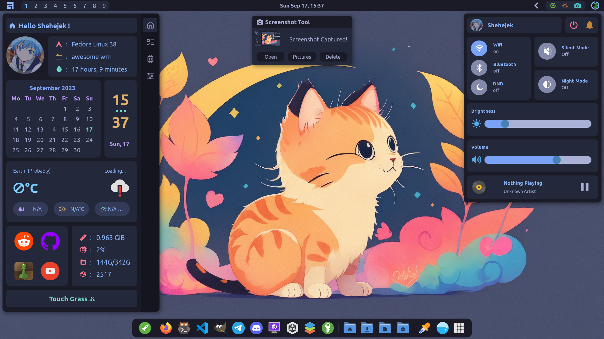
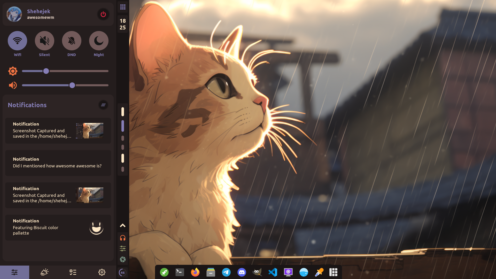
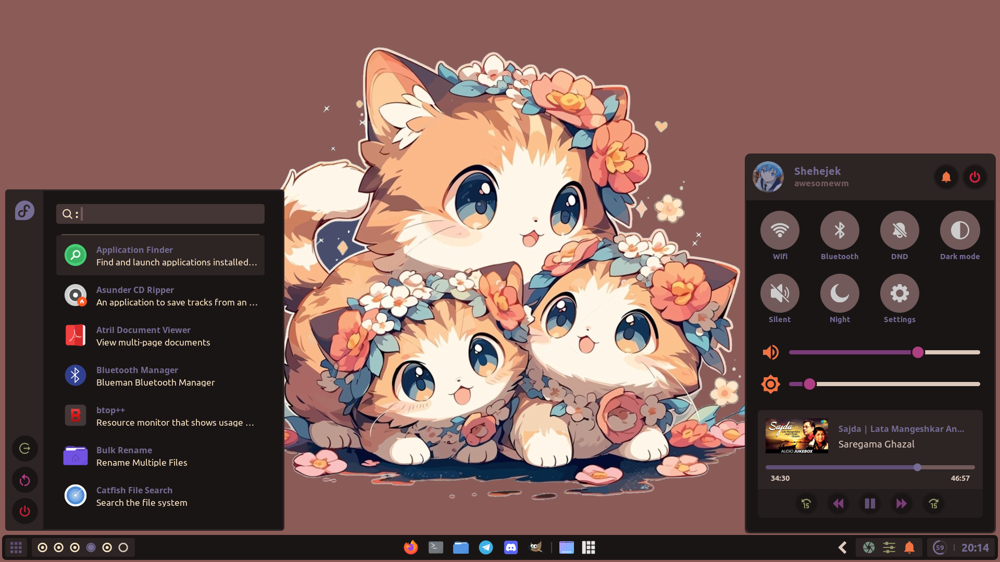

<h3 align="center">Featuring AwesomeWM</h3> 

Welcome to my stash of dotfiles of my AwesomeWM setups and config files for some other programmes I use. Note that I am a pro procrastinator and not a pro programmer, so there may be some broken code and incomplete stuff in the dotfiles. 

---

## [1. TOPBAR + DOCK](https://github.com/Amitabha37377/Awful-DOTS/tree/topbar_dock)

My favourite awesomewm setup and also my daily driver. I took some inspiration form MacOS for the design which is clearly visible for control center. Also contains some cool widgets I thought it will be nice to have.

---

## [2. SLIDING VERTICAL BAR](https://github.com/Amitabha37377/Awful-DOTS/tree/vertical_bar)

A setup with sliding vertical bar. Aim was to make a featureful desktop while also minimizing the clutter in the screen as much as possible. Also has some cool animations thanks to <a href="https://github.com/andOrlando/rubato">rubato</a>. The animations may cause some lag and performance issues though.

---

## [3. BOTTOMBAR](https://github.com/Amitabha37377/Awful-DOTS/tree/bottom-bar)

AwesomeWM setup containing bottom bar. The design was inspired from the design of chrome os and Windows 11. This config is kinda abandoned at this point though.

