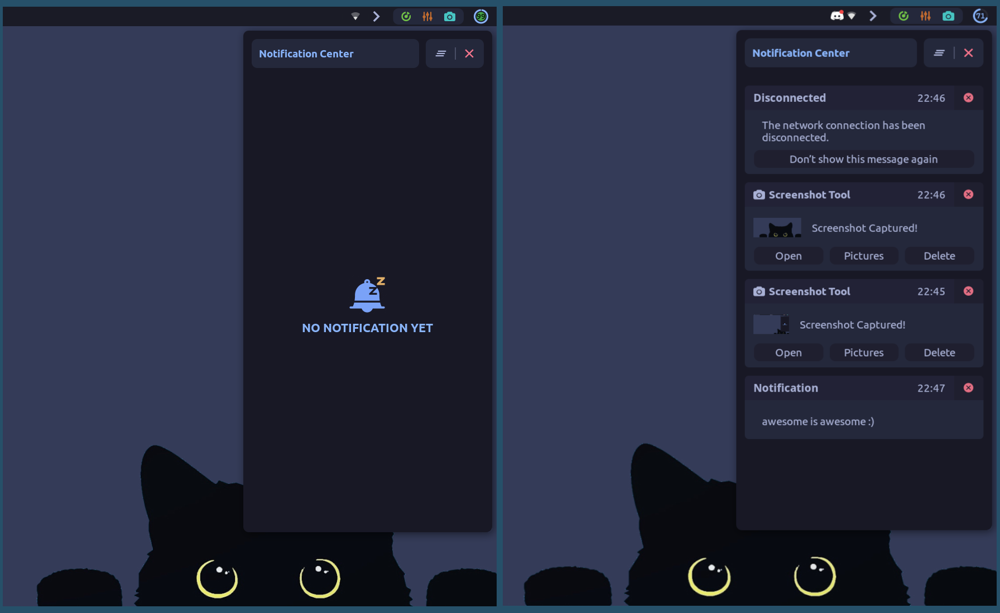
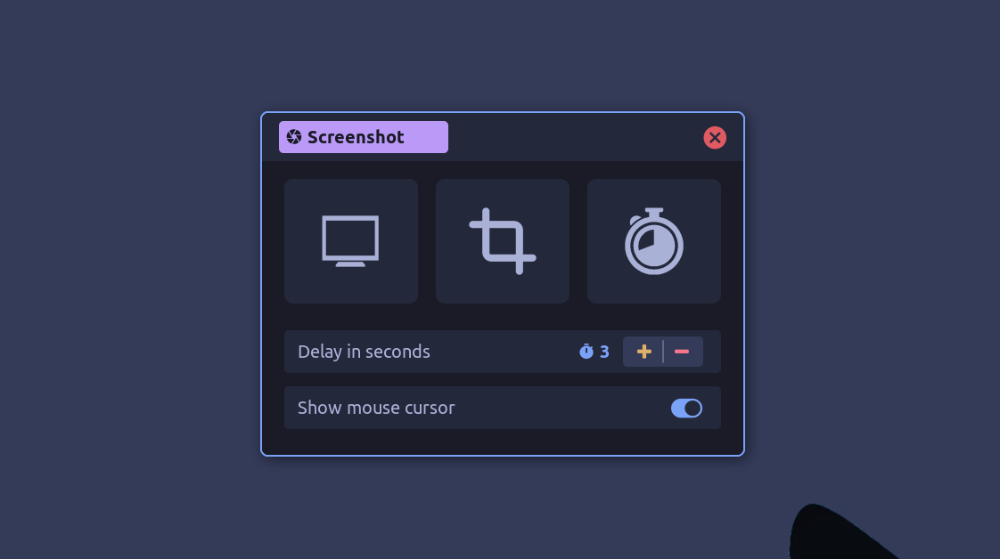
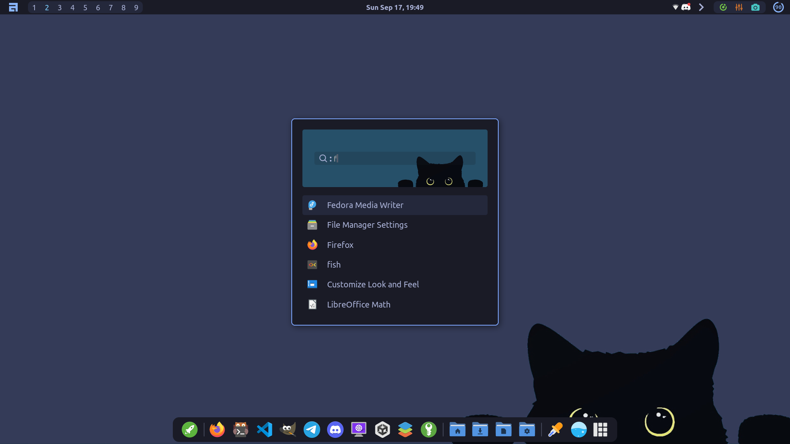
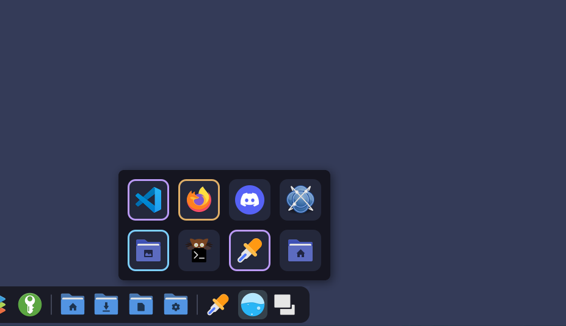

<p align="center"></p>
<h4 align="center">Featuring AwesomeWM</h4><br/><br/>

<p align="center"></p><br>

Welcome to my stash of dotfiles of my awesomewm setup. Note that things are
likely to be changed in future as I am still working on this setup. Feel free to
give a :star: to this repo if you liked the setup. It is much appreciated :3

---

## Dependencies

- **AwesomeWM**: Use the git version. Stable version will not work.
- **Picom**: Use any picom fork of your liking. (I'm using
  <a href="https://github.com/fdev31/picom">fdev31's fork</a>)
- **nm-applet**: Used for wifi.
- **Light**: Required for the brightness control slider
- **Alsa Utils**: Required for the volume control slider.
- **acpi**: Required for the battery widget. You can skip that if you don't have
  a battery.
- **Nitrogen**: Another wallpaper setter. This is optional though.
- **Playerctl**: Required for the music player widget located in the control
  center.
- **Redshift**: Used in the bluelight filter widget.
- **Scrot**: Used in screenshot tool.
- **Gpick**: Color picker.
- **Font**: Ubuntu Nerd font is used most of the ui, CaskaydiaCove nerd font and
  JetbrainsMono nerd font is also used in some place.
- **Icon Theme**: Papirus(required)
- **GTK Theme**: Lavanda Dark Compact Tokyonight (Thanks to
  <a href="https://github.com/mehedirm6244">Mebesus</a>)

These are all I remember right now. If there is any other dependencies that I
missed, feel free to open an github issue to inform me.

## Defaults

- **File manager**: Thunar
- **Terminal**: Kitty
- **Browser**: Firefox

---

## Installation

Installing the config may break somethings in your pc as I can only try them in
my computer. But in case you want to use them anyway, follow the bellow steps:-

<details>
<summary><b style="font-size:20px">Install Awesome-git</b></summary>

<br>
<b>Arch</b>

```bash
yay -S awesome-git
```

<br>

<b>Fedora</b><br> You can build from source, or you can use COPR if you are lazy
like me. For installing through COPR, follow below steps:-

```bash
sudo dnf copr enable coolj/awesome-luajit-nightly
sudo dnf install awesome
```

<br>

<b>Ubuntu and other Debian based</b><br> Again, you can build from source, or
you can use pacstall. To install using pacstall, followbelow steps:-

```bash
sudo bash -c "$(wget -q https://pacstall.dev/q/install -O -)"    #for setting up pacstall(Skip if you already done it)
pacstall -I awesome-git
```

</details>
<br>
<details>
<summary><b style="font-size:20px">Install Dependencies</b></summary>

Use the package manager to install the following dependencies:-

**Necessary**
```bash
nm-applet NetworkManager light alsa-utils acpi playerctl scrot picom
```
<i>(Also `libplayerctl-dev` for ubuntu based distributions)</i><br/>

**Optional but recommended for a complete experience**
```bash
redshift gpick nitrogen lxappearance
```
The name of some packages may vary based on your distro.
<i> <b>Note</b>: For Ubuntu and ubuntu/debian based distros additional
dependency `libplayerctl-dev` </i>

</details>
<br>
<details>
<summary><b style="font-size:20px">Move the files to their location</b></summary>

Clone this repository:-

```bash
git clone https://github.com/Amitabha37377/Awful-DOTS.git
cd Awful-DOTS
```

Make `~/.themes`, `~/.icons`, `~/.local/share/fonts` directories if not exists
already.

```bash
mkdir ~/.themes
mkdir ~/.icons
mkdir ~/.local/share/fonts
```

Move the files in their required directory:-

```bash
mv ~/.config/awesome ~/.config/awesome.bak
cp -r awesome ~/.config/
cp -r Misc/fonts/* ~/.local/share/fonts/
cp -r Misc/gtk_themes/* ~/.themes/
cp -r Misc/icon_packs/* ~/.icons/
```

</details>
<br>
After following all the steps restart awesome wm. Hopefully everything will work.
Feel free to open a github issue if you face any problem. I am nowhere near an awesomewm/lua expert but I will try my best to help.

---

## Gallery

|Control Center, Dashboard & Notification theme|
|---|
| <p align="center"></p>|

|Notification Center|
|---|
|<p align="center">
</p>|


|Screenshot Tool|
|---|
|<p align="center">
</p>|

|Powermenu|
|---|
|<p align="center"></p>|

|App Launcher|
|---|
|<p align="center"></p>|

| Media Player (Supports Youtube, Idk what else it supports)|
|---|
|<p align="center"></p>|

|Tasklist popup box|
|---|
|<p align="center"></p>|
---

## To Do
- Implementing global search in app launcher
- Screen recording widget
- <s>Dashboard</s>
- System monitor widget
- To do widget
- <s>Music player widget outside the control center</s>
- Improve animations (maybe)
- Preference setting widget
- Inbuilt wallpaper switcher

---
- #### How to make the media player functional?

  First make sure that `plasma-browser-integration` package is installed in your
  system. Install `plasma integration` browser extension in firefox. Go to the
  manage extension settings of the `plasma integration` extension and uncheck
  `Enhanced Media Control`. Hopefully it will work.
  <i>(The media player might have some bugs/issues right now.)</i>
  <br>

- #### Setting up the Weather Widget inside dashboard

  First of all make an account in https://openweathermap.org/ and generate the
  api key and get your city ID. Then make a file names `weather.sh` in your home
  directory and put the below script in that file:

  ```bash
  bash -c '
    KEY="<api-key>"
    CITY="<city ID>"
    UNITS="metric"
    weather=$(curl -sf "http://api.openweathermap.org/data/2.5/weather?APPID=$KEY&id=$CITY&units=$UNITS")
    if [ ! -z "$weather" ]; then
        
        weather_temp=$(echo "$weather" | jq ".main.temp" | cut -d "." -f 1)

        weather_icon=$(echo "$weather" | jq -r ".weather[].icon" | head -1)
        
        weather_description=$(echo "$weather" | jq -r ".weather[].description" | head -1)
        
        location=$(echo "$weather" | jq -r ".name")
        
        country=$(echo "$weather" | jq -r ".sys.country")
        
        humidity=$(echo "$weather" | jq -r ".main.humidity")
        
        wind=$(echo "$weather" | jq -r ".wind.speed" |  cut -d "." -f 1)
        
        feelslike=$(echo "$weather" | jq -r ".main.feels_like" | cut -d "." -f 1)

        echo "$weather_icon"  "$feelslike" "$weather_temp" "$location" "$country" "$humidity" "$wind" "$weather_description"
        # echo "$weather" 
    else
        echo "... N/A  Earth (Probably) N/A N/A Loading..."
    fi'
  ```

  replace the `<api key>` with your actual openweather api key and replace
  `<city ID>` with your city ID in the `weather.sh` file

---

## Credits

- <a href="https://github.com/Stardust-kyun"><b>Stardust kyun</b></a> (His
  absolutely amazing beginner friendly dotfiles. Stole some part of code from
  his notification center, app launcher, notification settings)
- <a href="https://github.com/rxyhn"><b>rxyhn</b></a> (Used his colorscheme from
  yoru in many places)
- <a href="https://github.com/manilarome"><b>Manilarome</b></a> (Stole some
  widgets. )
- <a href="https://github.com/BlingCorp/bling"><b>Bling</b></a> (Used the app
  launcher and playerctl widget)
- <a href="https://github.com/streetturtle/awesome-wm-widgets"><b>Awesome wm
  widgets by streetturtle</b></a> (Used the calendar widget and battery widget)

And many other awesome people who answered my stupid questions in discord and
from whom I got inspiration and design ideas.

---
